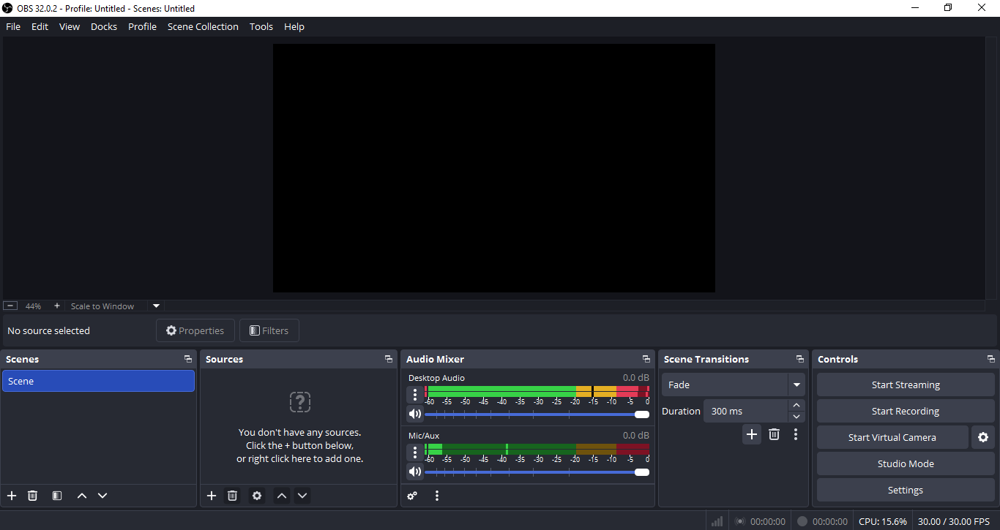
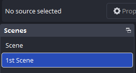
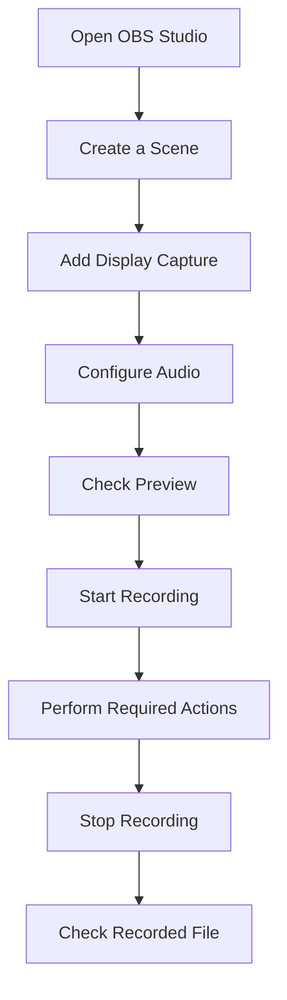

# **OBS Studio Documentation**

##  1. Introduction
OBS Studio (Open Broadcaster Software Studio) is a free and open-source application for video recording and live streaming.

OBS Studio allows users to capture and combine multiple sources, such as:
1. Display or window captures
1. Webcams
1. Microphones
1. Application audio
1. Images
1. Videos
1. Browser content

This documentation provides a beginner-friendly guide to installing and using OBS Studio for basic screen recording.

**Purpose**
This guide is intended to help first-time users:

1. Install OBS Studio.
1. Understand the OBS Studio interface.
1. Create and configure a scene.
1. Add video and audio sources.
1. Configure basic recording settings.
1. Record a screen using OBS Studio.

**Target Audience**

This documentation is intended for users who have little or no previous experience with OBS Studio.
##  2. System Requirements
Before installing OBS Studio, make sure your computer meets the minimum requirements for your operating system.

**Supported Operating Systems**
OBS Studio supports major desktop operating systems, including:
1. Windows
1. macOS
1. Linux

**Hardware Considerations**

The hardware requirements may vary depending on the recording or streaming workload.

For example, recording at higher resolutions or frame rates may require more processing power.

|Component	|Consideration|
|---|---|
|Processor	|A modern CPU is recommended for video recording and encoding.|
|Graphics	|GPU capabilities may affect recording and rendering performance.|
|Memory	|More memory may be required when using multiple sources or applications.|
|Storage	|Recorded videos can require significant storage space.|
|Internet	|A stable internet connection is required for live streaming.|
> Note: System requirements may vary depending on the selected resolution, frame rate, encoder, and number of sources.
{.is-info}

##  3. Installation Guide
This section explains how to install OBS Studio on Windows.
**Step 1: Download OBS Studio**
1. Open the official OBS Studio website.
1. Select the Windows download option.
1. Download the installer.
1. Wait until the download is complete.
 
> Tip: Download OBS Studio from the official OBS Studio website to ensure that you are using the legitimate software.
> 

**Step 2: Run the Installer**
1. Locate the downloaded installer.
1. Double-click the installer file.
1. If Windows displays a security confirmation, review the information and continue if appropriate.

**Step 3: Start the Installation**
1. Follow the instructions displayed by the installation wizard.
1. Review the license information.
1. Select the installation location if prompted.
1. Continue with the installation.
1. Wait until the installation process is complete.

**Step 4: Launch OBS Studio**
After the installation is complete:

1. Launch OBS Studio.
1. Wait for the application to initialize.
1. The OBS Studio main window should appear.

📸 OBS Studio main interface after installation.

## 4. Getting Started
### 4.1 Interface Overview
When OBS Studio is opened, the main interface is divided into several sections.

**Main Interface Components**
|Component	|Description
|---|---|
|Preview	|Displays the current scene output.
|Scenes	|Contains the scenes available in the current OBS Studio profile.
|Sources	|Contains the visual and audio sources assigned to the selected scene.
|Audio |Mixer	Displays and controls audio sources.
|Scene |Transitions	Controls transitions between scenes.
|Controls	|Provides access to recording, streaming, settings, and other functions.|

📸 Label the main OBS Studio interface.
### 4.2 Create a Scene
A Scene is a collection of sources that determines what appears in the recording or stream.

To create a scene:

1. Open OBS Studio.
1. Locate the Scenes panel.
1. Click the + button.
1. Enter a name for the scene.
1. Click OK.

The new scene will appear in the Scenes panel.

> Tip: Use descriptive scene names to make your OBS Studio setup easier to manage.
> 

### 4.3 Add a Source
After creating a scene, you need to add one or more sources.

For example, to record your screen:
1. Select the scene you created.
1. Locate the Sources panel.
1. Click the + button.
1. Select Display Capture.
1. Enter a name for the source if prompted.
1. Select the display you want to capture.
1. Confirm the configuration.

The selected display should now appear in the preview area.
**Common Source Types**
|Source	|Purpose|
|---|---|
|Display Capture	|Captures an entire display.
|Window Capture	|Captures a specific application window.
|Video Capture |Device	Captures video from a webcam or other compatible device.
|Image	|Displays an image in the scene.
|Media Source	|Adds a video or audio file.
|Browser	|Displays web-based content.
> Note: Available source options may vary depending on the operating system and OBS Studio configuration.
{.is-info}

### 4.4 Configure Audio
OBS Studio can capture audio from different sources, such as your microphone and system audio.

**Configure a Microphone**
1. Locate the Audio Mixer panel.
1. Check whether a microphone source is available.
1. Speak into the microphone.
1. Observe the audio level indicator.

If the microphone is working correctly, the audio level should respond to your voice.

**Adjust Audio Volume**
Use the volume slider in the Audio Mixer to adjust the input level.

> Tip: Avoid setting the microphone level too high because excessive input levels can cause audio distortion.
{.is-info}

### 4.5 Start Recording
Before starting the recording, verify that:

- The correct scene is selected.
- The required sources are visible.
- Your microphone is working.
- The desired audio sources are enabled.
To start recording:

1. Select the scene you want to record.
1. Check the preview.
1. Confirm the audio levels.
1. Click Start Recording.
1. Perform the actions you want to record.
To stop the recording:

1. Return to OBS Studio.
1. Click Stop Recording.
1. Wait for OBS Studio to finish processing the recording.

The recorded file will be saved according to the configured recording path.

## 5. Recording Guide
This section provides a basic workflow for recording a screen using OBS Studio.

**Basic Recording Workflow**

**Recommended Pre-Recording Checklist**
- [ ] Select the correct scene.
- [ ] Verify the display capture.
- [ ] Check microphone input.
- [ ] Check system audio.
- [ ] Confirm available storage space.
- [ ] Review recording settings.
- [ ] Perform a short test recording.

## 6. Common Settings
OBS Studio provides various settings that control how recordings are captured and stored.

**Output Settings**
Output settings can affect:

- Recording quality
- File format
- Encoder
- Recording location
- Bitrate

**Video Settings**
Video settings include options such as:

- Base Canvas Resolution
- Output Resolution
- Common FPS Value

Higher resolutions and frame rates may require more system resources.

**Audio Settings**

Audio settings control the audio devices and sample rate used by OBS Studio.
> Note: The recommended configuration depends on the user's hardware and recording requirements.
{.is-info}

## 7. Troubleshooting
**OBS Studio Does Not Detect My Microphone**

**Possible causes:**

- The microphone is not connected.
- The wrong input device is selected.
- Windows does not have permission to access the microphone.
- Another application is using the microphone.

**Recommended actions:**

- Check whether the microphone is connected.
- Check the selected audio device in OBS Studio.
- Check Windows microphone permissions.
- Restart OBS Studio if necessary.

**The Recording Is Lagging**

Possible causes include insufficient system resources, high recording settings, or an unsuitable encoder configuration.

Try:

1. Lowering the output resolution.
1. Reducing the frame rate.
1. Closing unnecessary applications.
1. Checking CPU/GPU usage.
1. Reviewing the selected encoder.

## 8. FAQ
**What is OBS Studio?**

OBS Studio is a free and open-source application used for video recording and live streaming.

**Can OBS Studio record my screen?**

Yes. OBS Studio can capture an entire display or a specific application window.

**Can I record my webcam?**

Yes. A compatible webcam can be added as a Video Capture Device source.

**Can I record my microphone?**

Yes. OBS Studio can capture audio from a configured microphone.

**Is OBS Studio free?**

Yes. OBS Studio is free and open-source software.

**Where is my recording saved?**

The recording is saved in the configured recording location. You can check or change the location through OBS Studio's output settings.
## 9. References
**commended references:**

- Official OBS Studio website
- Official OBS Studio documentation
- OBS Studio GitHub repository
